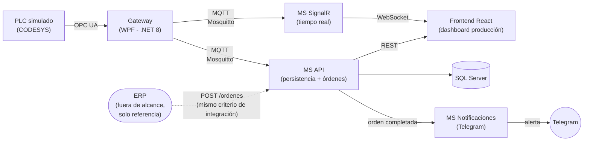

# Mini MES

**Mini MES** es un proyecto personal simplificado, pensado como proyecto de aprendizaje y portfolio, orientado a arquitectura de microservicios para la industria 4.0. que simula, a pequeña escala, un sistema **MES (Manufacturing Execution System)**.

La idea es que una máquina (simulada con un PLC) vaya reportando en vivo cuántas piezas produce, cuántas salen buenas y cuántas salen malas, que eso se pueda ver en tiempo real en un dashboard, que quede guardado un historial para consultarlo después, que se puedan generar **órdenes de producción** (por ejemplo "fabricar 500 piezas del producto X"), y que cuando una orden termine, llegue una **notificación automática** (por ahora por Telegram) avisando que se completó.

Todo esto armado como un conjunto de **microservicios independientes**, cada uno con una responsabilidad puntual, más que como una aplicación monolítica.

> ⚠️ **Estado actual del proyecto:** en desarrollo activo. Por ahora solo está implementado el **Gateway OPC UA** (`GateWay/`), que es la parte que se conecta a la máquina/PLC. El resto de los microservicios (persistencia, órdenes, tiempo real, notificaciones) y el frontend están en etapa de diseño / roadmap (ver más abajo).

---

## ¿Qué se va a poder hacer? (resumen funcional)

**Monitoreo en vivo** de las variables de producción de la máquina (piezas totales, piezas buenas, piezas malas, estado de la línea).
**Historial de producción**, guardado como snapshots, consultable y filtrable desde un dashboard web.
**Creación de órdenes de producción**, mediante un endpoint expuesto por la API. La idea es que ese endpoint quede pensado con el mismo criterio con el que un ERP real se conectaría a un MES. **Aclaración importante:** en este proyecto no se va a implementar ni simular la conexión de un ERP real — el endpoint va a estar disponible y probado (vía Swagger o una interfaz simple, todavía a definir), pero la integración con un ERP queda fuera del alcance.
**Notificaciones automáticas**: cuando una orden de producción se completa, un microservicio de comunicación va a enviar un aviso. La primera integración va a ser por **Telegram**, con la posibilidad de configurar qué alertas se quieren recibir.

---

## Arquitectura general (visión final)

La idea es simular un entorno productivo real, donde un PLC (simulado con **CODESYS**) expone variables vía **OPC UA**, y a partir de ahí la información fluye por MQTT hacia distintos microservicios especializados:

**Flujo pensado:**

1. El **Gateway** se conecta al PLC vía OPC UA, permite explorar/filtrar el árbol de nodos y suscribirse a las variables de interés.
2. El Gateway publica los valores leídos por **MQTT (Mosquitto)** como broker intermediario.
3. Un **microservicio de SignalR** consume esos mensajes MQTT y los reenvía en tiempo real al frontend (piezas totales, piezas buenas, piezas malas, estado de la línea, etc).
4. Un **microservicio de API** consume los mismos mensajes MQTT y genera **snapshots** persistidos en **SQL Server**, para poder consultar históricos desde el frontend. Este mismo servicio expone endpoints para la **gestión de órdenes de producción** (crear, consultar, cerrar órdenes).
   - Estos endpoints se diseñan pensando en cómo un ERP se conectaría en un escenario real. **No se va a implementar un ERP ni una conexión real con uno** — el endpoint se prueba vía Swagger o alguna interfaz simple propia, quedando disponible por si en el futuro se quisiera integrar.
5. Cuando una orden de producción se marca como completada, el **microservicio de notificaciones** envía una alerta. La primera integración es por **Telegram**, con soporte para configurar qué eventos/alertas se quieren recibir.
6. El **frontend en React** consume los microservicios de SignalR (dato en vivo) y de API (históricos y gestión de órdenes).

---

## Estado actual

### ✅ Gateway OPC UA (implementado)

Aplicación de escritorio en **WPF (.NET 8)** que actúa como puente entre el PLC y el resto del sistema.

**Funcionalidades actuales:**

- Conexión a un servidor OPC UA indicando la URL y un nombre identificador de la máquina.
- Exploración del árbol de nodos del servidor OPC UA una vez conectado.
- Filtro de nodos por nombre de variable, con dos modos:
  - Filtrar solo el nodo puntual encontrado.
  - Filtrar todos los nodos que estén al mismo nivel jerárquico que el nodo encontrado.
- Selección de nodos mediante checkboxes en el árbol.
- Suscripción a los nodos seleccionados para recibir sus valores.
- Ventana de monitoreo independiente con una grilla que muestra, por cada variable suscripta:
  - Nombre de la variable
  - NodeId
  - Valor actual
  - Fecha/hora de la última actualización

**Lo que todavía NO hace (a propósito, es el siguiente paso):**

- Todavía no publica los datos por MQTT — hoy el consumo es únicamente visual, en la propia ventana de monitoreo de la app WPF.

## Stack tecnológico

**Actual:**
- **.NET 8** / **WPF** — Gateway
- **OPC UA** (Nuget: `OpcUaHelper`) — comunicación con el PLC
- **CODESYS** — simulación de PLC para pruebas

**Planeado:**
- **MQTT (Mosquitto)** — mensajería entre Gateway y microservicios
- **ASP.NET Core + SignalR** — servicio de tiempo real
- **ASP.NET Core Web API** — persistencia y gestión de órdenes (documentado con Swagger)
- **SQL Server** — almacenamiento de snapshots históricos
- **Telegram Bot API** — microservicio de notificaciones/alertas
- **React** — para el frontend
